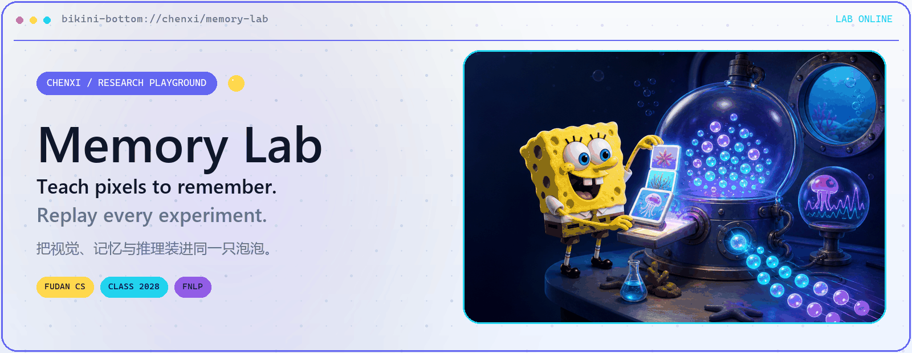
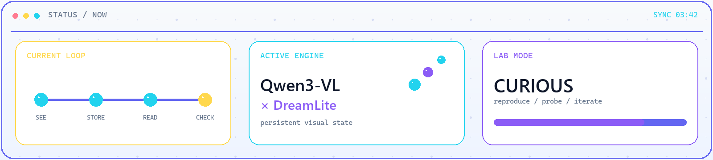
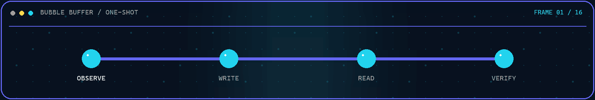
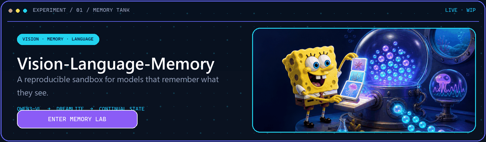
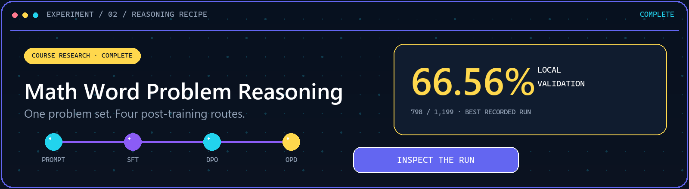
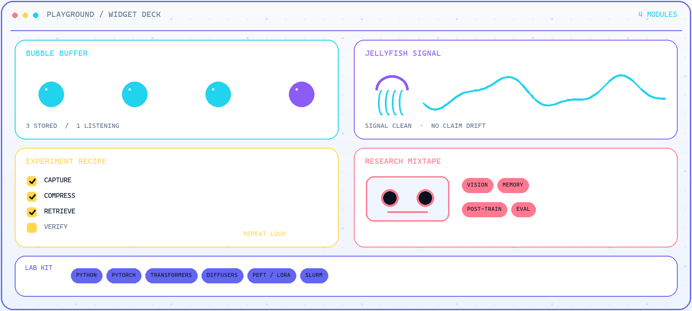
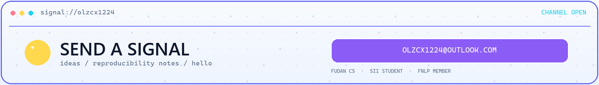

  <picture>
    <source media="(prefers-color-scheme: dark) and (max-width: 600px)" srcset="./assets/playground-hero-mobile-dark.png">
    <source media="(prefers-color-scheme: light) and (max-width: 600px)" srcset="./assets/playground-hero-mobile-light.png">
    <source media="(prefers-color-scheme: dark)" srcset="./assets/playground-hero-dark.png">
    <source media="(prefers-color-scheme: light)" srcset="./assets/playground-hero-light.png">
    
  </picture>

  <samp>CHENXI ZHANG · FUDAN CS · CLASS OF 2028 · SII STUDENT · FNLP MEMBER</samp>

  <a href="https://github.com/zhangchenxi1224/Vision-Language-Memory"><kbd>MEMORY LAB</kbd></a>
  ·
  <a href="https://github.com/zhangchenxi1224/Fudan2026AIProjectSubmission"><kbd>REASONING LOG</kbd></a>
  ·
  <a href="mailto:OLzcx1224@outlook.com"><kbd>SEND A SIGNAL</kbd></a>

让模型记住它看见的，也让实验经得起复现。

  <picture>
    <source media="(prefers-color-scheme: dark) and (max-width: 600px)" srcset="./assets/system-now-mobile-dark.png">
    <source media="(prefers-color-scheme: light) and (max-width: 600px)" srcset="./assets/system-now-mobile-light.png">
    <source media="(prefers-color-scheme: dark)" srcset="./assets/system-now-dark.png">
    <source media="(prefers-color-scheme: light)" srcset="./assets/system-now-light.png">
    
  </picture>

  <picture>
    <source media="(prefers-reduced-motion: reduce) and (max-width: 600px)" srcset="./assets/bubble-pulse-mobile-static.png">
    <source media="(prefers-reduced-motion: reduce)" srcset="./assets/bubble-pulse-static.png">
    <source media="(max-width: 600px)" srcset="./assets/bubble-pulse-mobile.gif">
    
  </picture>

  <a href="https://github.com/zhangchenxi1224/Vision-Language-Memory">
    <picture>
      <source media="(max-width: 600px)" srcset="./assets/project-memory-mobile.png">
      
    </picture>
  </a>

  <a href="https://github.com/zhangchenxi1224/Fudan2026AIProjectSubmission">
    <picture>
      <source media="(max-width: 600px)" srcset="./assets/project-reasoning-mobile.png">
      
    </picture>
  </a>

  <picture>
    <source media="(prefers-color-scheme: dark) and (max-width: 600px)" srcset="./assets/widget-deck-mobile-dark.png">
    <source media="(prefers-color-scheme: light) and (max-width: 600px)" srcset="./assets/widget-deck-mobile-light.png">
    <source media="(prefers-color-scheme: dark)" srcset="./assets/widget-deck-dark.png">
    <source media="(prefers-color-scheme: light)" srcset="./assets/widget-deck-light.png">
    
  </picture>

<strong>🫧 Open the lab notebook</strong> · identity, methods, and exact result notes

### Research coordinates

- **Chenxi Zhang** · Undergraduate Student in Computer Science · Class of 2028
- [College of Computer Science and Artificial Intelligence, Fudan University](https://ai.fudan.edu.cn/93/7b/c24260a758651/page.htm)
- Student at [Shanghai Innovation Institute](https://www.sii.edu.cn/) · Member of [Fudan NLP Lab](https://nlp.fudan.edu.cn/nlpen/main.htm)
- Exploring persistent multimodal memory, LLM post-training, reliable evaluation, and reproducible ML systems

### 01 / Vision-Language-Memory

- **Status:** Research · Work in progress
- **Loop:** visual frames → latent state → frozen vision-language reader → controlled evaluation
- **Kit:** Qwen3-VL · DreamLite · synthetic episodes · PrefEval adapters · Slurm
- **Scope:** framework and experiment pipeline in development; no effectiveness or generalization claim yet
- [Enter the repository](https://github.com/zhangchenxi1224/Vision-Language-Memory)

### 02 / Math Word Problem Reasoning

- **Route:** direct/few-shot prompting → LoRA SFT → teacher CoT-SFT → CoT-DPO → OPD
- **Recorded result:** **66.56% local validation accuracy (798/1,199)** from `Teacher CoT-SFT full`
- Local validation metric only · not an official online score
- Negative OPD results and fallback decisions are preserved in the repository
- [Inspect the experiment log](https://github.com/zhangchenxi1224/Fudan2026AIProjectSubmission)

### Lab kit

`Python` · `PyTorch` · `Transformers` · `Diffusers` · `PEFT / LoRA` · `Slurm`

 

  <a href="mailto:OLzcx1224@outlook.com">
    <picture>
      <source media="(prefers-color-scheme: dark) and (max-width: 600px)" srcset="./assets/signal-bar-mobile-dark.png">
      <source media="(prefers-color-scheme: light) and (max-width: 600px)" srcset="./assets/signal-bar-mobile-light.png">
      <source media="(prefers-color-scheme: dark)" srcset="./assets/signal-bar-dark.png">
      <source media="(prefers-color-scheme: light)" srcset="./assets/signal-bar-light.png">
      
    </picture>
  </a>

Local assets · one-shot animation · no trackers · no vanity stats

