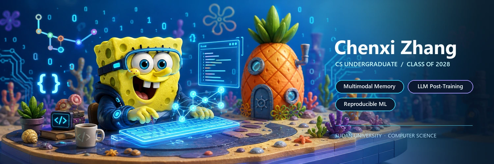

  <picture>
    <source media="(prefers-color-scheme: dark) and (max-width: 600px)" srcset="./assets/header-mobile-dark.webp">
    <source media="(prefers-color-scheme: light) and (max-width: 600px)" srcset="./assets/header-mobile-light.webp">
    <source media="(prefers-color-scheme: dark)" srcset="./assets/header-dark.webp">
    <source media="(prefers-color-scheme: light)" srcset="./assets/header-light.webp">
    
  </picture>

  

  Undergraduate Student in Computer Science · Class of 2028 
  <a href="https://ai.fudan.edu.cn/93/7b/c24260a758651/page.htm">College of Computer Science and Artificial Intelligence, Fudan University</a> 
  Student at <a href="https://www.sii.edu.cn/">Shanghai Innovation Institute</a> · Member of <a href="https://nlp.fudan.edu.cn/nlpen/main.htm">Fudan NLP Lab</a>

  <strong>Building reproducible multimodal memory and LLM post-training systems.</strong> 
  关注可复现的多模态记忆、LLM 后训练与可靠评测。

  

 

<h3 align="center">Toolbox</h3>

  
  
  
  
  
  

 

<h3 align="center">GitHub Activity</h3>

  <picture>
    <source media="(prefers-color-scheme: dark)" srcset="./profile/stats-dark.svg">
    <source media="(prefers-color-scheme: light)" srcset="./profile/stats-light.svg">
    
  </picture>

  <picture>
    <source media="(prefers-color-scheme: dark)" srcset="./profile/top-langs-dark.svg">
    <source media="(prefers-color-scheme: light)" srcset="./profile/top-langs-light.svg">
    
  </picture>

 

<h3 align="center">Contribution Current</h3>

  <picture>
    <source media="(prefers-color-scheme: dark)" srcset="https://raw.githubusercontent.com/zhangchenxi1224/zhangchenxi1224/output/github-contribution-grid-snake-dark.svg">
    <source media="(prefers-color-scheme: light)" srcset="https://raw.githubusercontent.com/zhangchenxi1224/zhangchenxi1224/output/github-contribution-grid-snake.svg">
    
  </picture>

