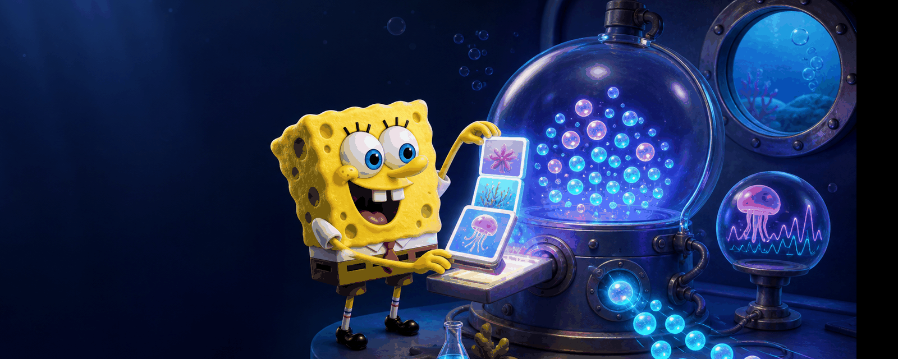

  <picture>
    <source media="(max-width: 600px)" srcset="./assets/spongebob-memory-lab-mobile.png">
    
  </picture>

<h1 align="center">Chenxi Zhang</h1>

  Undergraduate Student in Computer Science · Class of 2028 
  <a href="https://ai.fudan.edu.cn/93/7b/c24260a758651/page.htm">College of Computer Science and Artificial Intelligence, Fudan University</a> 
  Student at <a href="https://www.sii.edu.cn/">Shanghai Innovation Institute</a> · Member of <a href="https://nlp.fudan.edu.cn/nlpen/main.htm">Fudan NLP Lab</a>

  <strong>Building reproducible multimodal memory and LLM post-training systems.</strong> 
  关注可复现的多模态记忆、LLM 后训练与可靠评测。

  <a href="mailto:OLzcx1224@outlook.com">OLzcx1224@outlook.com</a>

