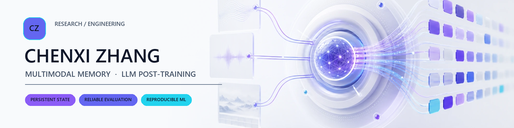
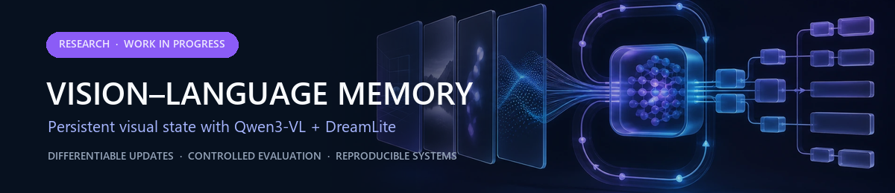
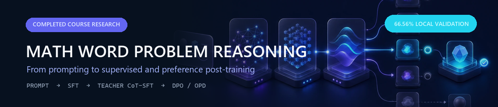

  <picture>
    <source media="(prefers-color-scheme: dark)" srcset="./assets/hero-dark.png">
    <source media="(prefers-color-scheme: light)" srcset="./assets/hero-light.png">
    
  </picture>

<h1 align="center">Chenxi Zhang</h1>

  Undergraduate Student in Computer Science · Class of 2028 
  <a href="https://ai.fudan.edu.cn/93/7b/c24260a758651/page.htm">College of Computer Science and Artificial Intelligence, Fudan University</a> 
  Student at <a href="https://www.sii.edu.cn/">Shanghai Innovation Institute</a> · Member of <a href="https://nlp.fudan.edu.cn/nlpen/main.htm">Fudan NLP Lab</a>

  <strong>Building reproducible multimodal memory and LLM post-training systems.</strong> 
  关注可复现的多模态记忆、LLM 后训练与可靠评测。

  <a href="mailto:OLzcx1224@outlook.com">Open to research collaborations and AI internship opportunities.</a>

---

## Current Focus

I study how persistent visual state can support memory across multi-turn interactions: how it should be written, retained, read, and evaluated. My current work combines differentiable state updates, frozen vision-language readers, and controlled evaluation protocols, with an emphasis on reproducibility and explicit claim boundaries.

  <picture>
    <source media="(prefers-reduced-motion: reduce)" srcset="./assets/memory-flow-static.png">
    
  </picture>

## Selected Work

### [Vision-Language-Memory](https://github.com/zhangchenxi1224/Vision-Language-Memory)

`Research` · `Work in Progress`

A reproducible engineering framework for stateful visual-memory experiments with DreamLite and a frozen Qwen3-VL reader. The repository develops differentiable recurrent state paths, strict gradient and trajectory-parity probes, synthetic episode protocols, PrefEval adapters, and Slurm-based experiment orchestration.

**Current status:** The framework and formal experiment pipeline are under active development. The project does not yet claim training effectiveness, generalization gains, or equivalence to repeated public DreamLite edits.

[Explore the project →](https://github.com/zhangchenxi1224/Vision-Language-Memory)

---

### [Math Word Problem Reasoning: From Prompting to Post-training](https://github.com/zhangchenxi1224/Fudan2026AIProjectSubmission)

`Completed Course Research`

An end-to-end study of elementary math word-problem solving, covering direct and few-shot prompting, answer-only LoRA SFT, teacher-generated CoT-SFT, CoT-DPO, OPD experiments, self-consistency, and validation-based fallback.

**Result:** `Teacher CoT-SFT full` achieved **66.56% local validation accuracy (798/1,199)**, the best local-validation result recorded in the project. This figure is a local validation metric, not an official online score.

The repository also preserves unsuccessful OPD iterations and retains the SFT baseline when OPD variants do not improve validation accuracy.

[Explore the project →](https://github.com/zhangchenxi1224/Fudan2026AIProjectSubmission)

## Research Interests

- Persistent multimodal memory and stateful vision-language systems
- LLM post-training, including supervised fine-tuning and preference optimization
- Reliable evaluation, ablation design, and negative-result analysis
- Reproducible ML systems and cluster experimentation

## Toolbox

`Python` · `PyTorch` · `Transformers` · `Diffusers` · `PEFT / LoRA` · `Slurm`

## Contact

I am open to research collaborations and AI internship opportunities.

[OLzcx1224@outlook.com](mailto:OLzcx1224@outlook.com)
